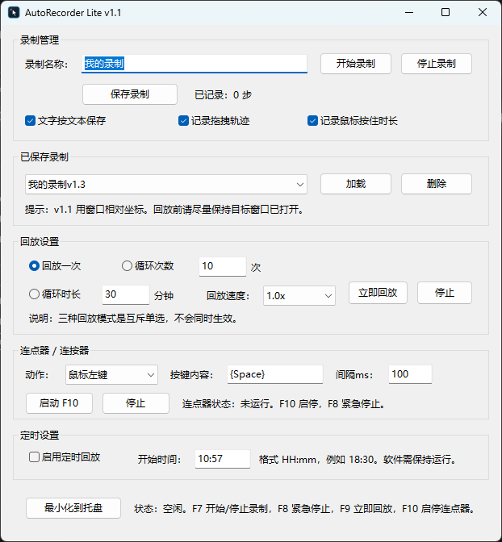

# AutoRecorder Lite

一个基于 **AutoHotkey v2** 的轻量级按键精灵/自动操作录制工具。

它可以录制常见桌面软件和网页中的鼠标、键盘操作，并支持立即回放、循环回放、定时回放、拖拽轨迹、鼠标按住时长，以及内置连点器/连按器。

> 当前版本定位为初代可用版，适合轻量办公自动化、重复点击、简单流程回放等场景。

## 界面预览



## 功能特性

- 录制鼠标操作：左键、右键、中键、侧键、滚轮。
- 记录鼠标按住时长，支持长按、拖拽等操作。
- 记录拖拽轨迹，回放时尽量复现鼠标移动路径。
- 录制键盘操作：普通按键、功能键、方向键、组合键。
- 宏文件保存为 JSON，默认保存在程序目录下的 `macros` 文件夹。
- 支持加载、删除已保存的录制宏。
- 支持窗口相对坐标回放。
- 支持三种回放模式：
  - 回放一次
  - 循环指定次数
  - 循环指定时长
- 支持回放速度选择：`1.0x`、`1.25x`、`1.5x`、`2.0x`。
- 支持定时回放，时间格式为 `HH:mm`。
- 内置连点器/连按器。
- 支持托盘运行，关闭主窗口后仍可从托盘恢复。
- 支持全局热键快速控制。

## 快捷键

| 快捷键 | 功能 |
| --- | --- |
| `F7` | 开始/停止录制 |
| `F8` | 紧急停止录制、回放、连点器 |
| `F9` | 立即回放当前宏 |
| `F10` | 启动/停止连点器 |

## 使用方法

### 运行脚本

1. 安装 AutoHotkey v2。
2. 双击运行 `AutoRecorder_Lite_v0_1.ahk`。
3. 在主界面中设置录制名称、录制选项和回放选项。

### 录制宏

1. 点击“开始录制”，或按 `F7`。
2. 在目标软件中执行鼠标和键盘操作。
3. 再次按 `F7` 或点击“停止录制”。
4. 点击“保存录制”，宏文件会保存到 `macros` 文件夹。

### 回放宏

1. 在“已保存录制”中选择宏文件。
2. 点击“加载”。
3. 设置回放模式和速度。
4. 点击“立即回放”，或按 `F9`。

回放时可以随时按 `F8` 紧急停止。

## 连点器/连按器

连点器区域包含三个主要设置：

| 设置项 | 说明 |
| --- | --- |
| 动作 | 选择要重复执行的动作 |
| 按键内容 | 当动作选择“按键/组合键”时生效 |
| 间隔ms | 每次触发之间的间隔，单位毫秒 |

### 动作类型

| 动作 | 效果 |
| --- | --- |
| 鼠标左键 | 按设定间隔连续左键点击 |
| 鼠标右键 | 按设定间隔连续右键点击 |
| 鼠标中键 | 按设定间隔连续中键点击 |
| 按键/组合键 | 按设定间隔连续发送“按键内容” |

### 按键内容写法

“按键内容”使用 AutoHotkey 的 `Send()` 语法。

常用写法如下：

| 输入内容 | 效果 |
| --- | --- |
| `{Space}` | 空格 |
| `{Enter}` | 回车 |
| `{Tab}` | Tab |
| `{Esc}` | Esc |
| `{Backspace}` | 退格 |
| `{Delete}` | Delete |
| `{F5}` | F5 |
| `{Left}` | 左方向键 |
| `{Right}` | 右方向键 |
| `{Up}` | 上方向键 |
| `{Down}` | 下方向键 |
| `{Left 5}` | 左方向键连续 5 次 |
| `a` | 输入字母 a |
| `abc` | 输入 abc |
| `^s` | Ctrl+S |
| `^c` | Ctrl+C |
| `^v` | Ctrl+V |
| `!{Tab}` | Alt+Tab |
| `+{Tab}` | Shift+Tab |
| `#{d}` | Win+D |

组合键符号：

| 符号 | 按键 |
| --- | --- |
| `^` | Ctrl |
| `!` | Alt |
| `+` | Shift |
| `#` | Win |

示例：

```text
{Enter}    Shift+Enter
^a         Ctrl+A
^+s        Ctrl+Shift+S
!{F4}      Alt+F4
```

## 已知限制

- 中文输入法最终上屏文字无法被 AutoHotkey `InputHook` 稳定捕获，因此中文文本录制不保证可靠。
- 回放依赖目标窗口存在，且窗口布局尽量与录制时一致。
- 当前坐标模式为窗口相对坐标，不是客户区坐标；窗口边框、标题栏、缩放比例变化可能影响点击位置。
- 如果目标程序以管理员权限运行，本工具也需要以管理员权限运行。
- 游戏、远程桌面、虚拟机、部分安全软件和自绘界面可能不响应模拟输入。
- `SendInput`、剪贴板粘贴、窗口激活等行为会受目标软件自身限制影响。

## 打包为 EXE

可以使用 AutoHotkey 官方工具 **Ahk2Exe** 打包。

### 图形界面方式

1. 安装 AutoHotkey v2。
2. 右键 `AutoRecorder_Lite_v0_1.ahk`。
3. 选择 `Compile Script`。
4. 选择输出文件名，例如 `AutoRecorder_Lite.exe`。
5. 图标可以选择本仓库中的 `AutoRecorder_Lite.ico`。

## 免责声明

本工具用于学习、办公自动化和个人效率提升。请勿用于违反软件服务条款、破坏系统安全、刷量作弊或其他不当用途。使用自动化脚本前，请确认你对目标软件和操作流程拥有相应权限。
